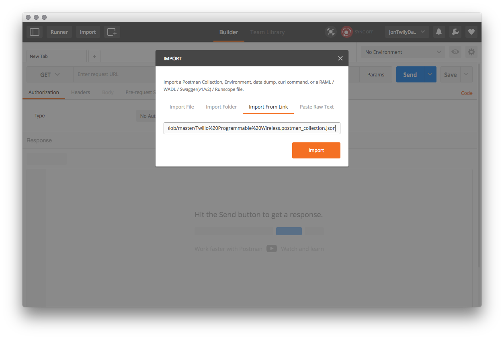
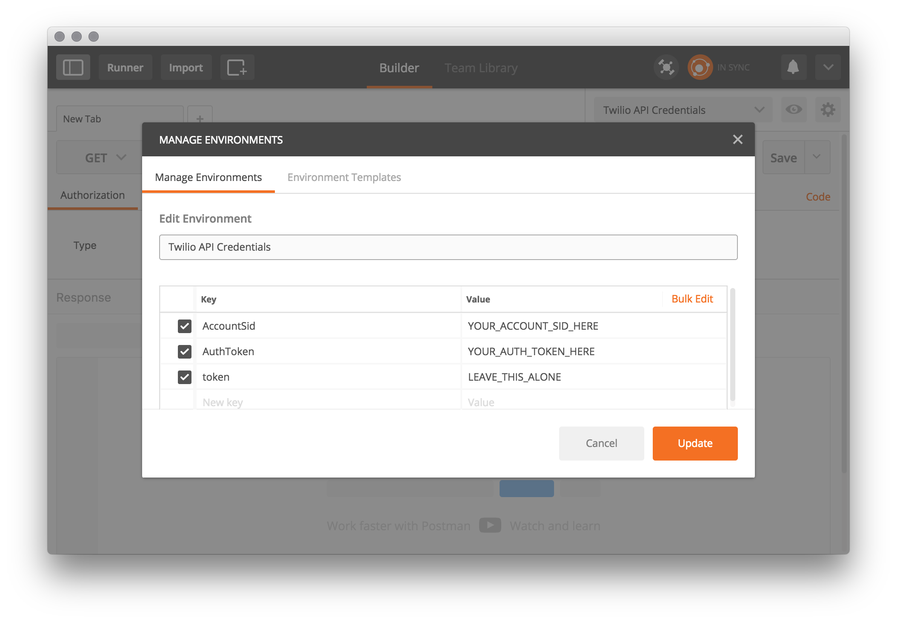
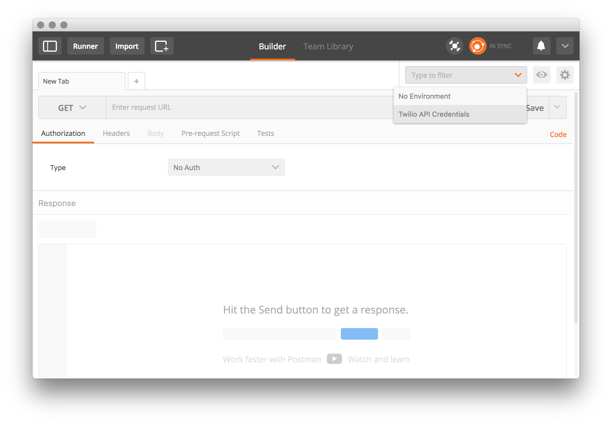

# Programmable Wireless Postman Collection

Programmable Wireless is a set of developer-first tools to deploy and manage fleets of wireless devices, powering connectivity for the Internet of Things and enabling highly customized Communications use cases.

This repository includes a group of Programmable Wireless HTTP requests for your convenience. You can learn more about Programmable Wireless HTTP request formats in the [Programmable Wireless Documentation](https://www.twilio.com/docs/api/wireless).

## What’s Postman?
A powerful GUI platform to make your API development faster and easier, from building API requests through testing, documentation and sharing.

## Where can I get Postman?
[GetPostman.com](https://www.getpostman.com/)

## Importing the Postman collection from GitHub
Postman collections can be imported in under a minute.
1. Open Postman
2. Click the Import button at the top left of the screen.
3. Click the Import From Link button
4. Paste the following url
    * https://raw.githubusercontent.com/twilio/wireless-postman-collection/master/Twilio%20Programmable%20Wireless.postman_collection.json
5. Click the Import button

## Setting Twilio Account Environment Variables in Postman once
Create Twilio Postman Environment Variables for your Twilio AccountSid and Auth Token once for this Postman collection.

### Where can I find my AccountSid?
You can find the AccountSid in the [Console](https://www.twilio.com/console/) dashboard. It is under the "Account Sid" label and starts with "AC".

### Where can I find my Auth Token?
You can find the Auth Token in the [Console](https://www.twilio.com/console/) dashboard hidden behind a bunch of dots. Click on these dots to reveal your AuthToken. Click on the lock icon to hide it again.

### Create a Postman Environment
1. Click the gear icon in the upper right corner of Postman and select “Manage Environments”. 
2. Click the Add button to create a new environment.
3. Enter **Twilio API Credentials** in the **Environment Name** input field.
4. Enter **AccountSid** in the key column of a new row
5. Enter your AccountSid in the value column
6. Enter **AuthToken** in the key column of a new row
7. Enter your AuthToken in the value column
8. Click **Add**

### Select the Twilio API Credentials Environment
1. Click the dropdown in the upper right corner of Postman to select the **Twilio API Credentials**.

That's it! Each Twilio Postman Collection will use these global variables to authenticate each HTTP request.

## Collection List
* [POST] Create Command (Binary)
* [POST] Create Command (Text)
* [POST] Create Rate Plan
* [GET] Retrieve Command Resource
* [GET] Retrieve All Commands
* [GET] Retrieve SIM Usage
* [GET] Retrieve Rate Plan Instance
* [GET] Retrieve All Rate Plans
* [DEL] Delete Rate Plan